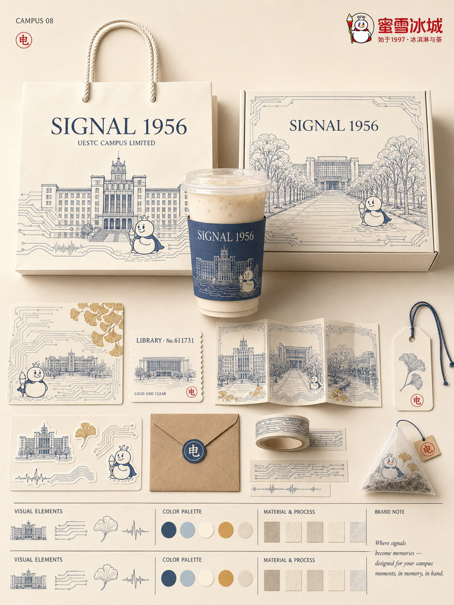
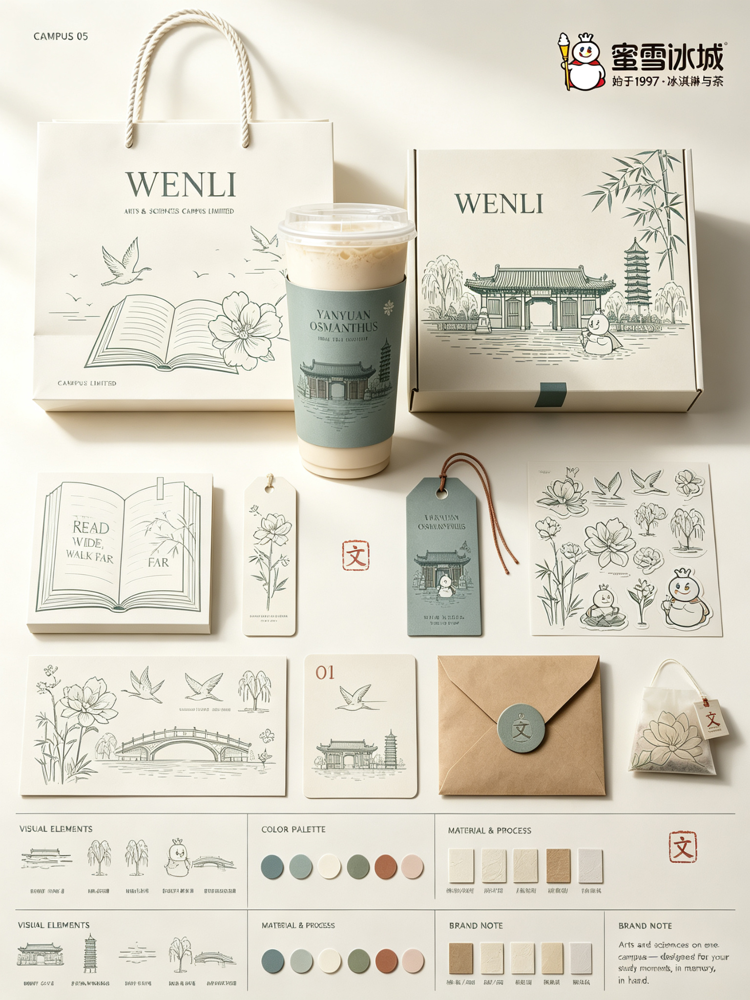
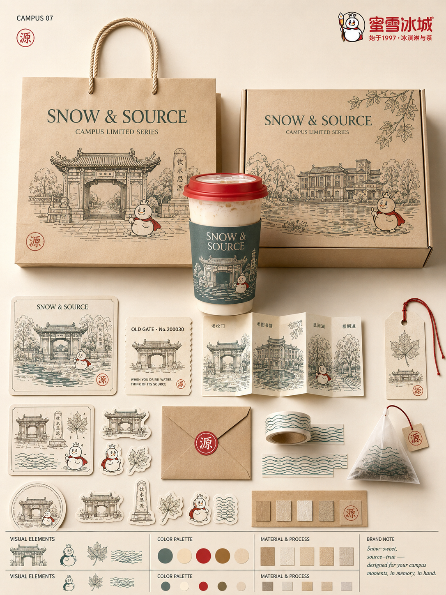

# Design Poster · 照片变品牌包装提案海报


> 🌏 **English version: [README.en.md](./README.en.md)**

一个适配 Claude Code / Codex / ZCode 等 Agent 环境的设计 Skill：把用户上传的**每一张照片**单独转译为一张**品牌包装系统提案板海报**——默认**融入式全板**：照片主体的轮廓、姿态与光影记忆点被提炼为核心图形，融洽地融入整张提案板，应用到 5–8 种包装载体，形成一套完整、统一、可延展的品牌视觉提案。

不是给照片加滤镜，也不是把照片修成插画：照片是**种子**，海报是**系统**——照片长出图形，图形长出整套包装语言，全部融在一张板子里。

**效果示意**（预览图位于 `assets/`，来自六校与校园×品牌联名实测生成）：

<p>
  
  
  
</p>

## 它做什么

```text
┌──────────────────────────────┐
│ 标题区（极简角标 或 营销大标语）  │
│                              │
│  ┌─────┐   ┌─────┐   ┌─────┐ │
│  │纸袋 ★│   │ 杯  │   │礼盒 ★│ │  ← 主包装三件，照片主体
│  └─────┘   └─────┘   └─────┘ │     已提炼为图形印于其上
│   小物料网格（吊牌/票券/贴纸…）  │  ← 横竖错开、尺度反差、留白
│  ──────────────────────────  │
│  视觉元素 │ 色板 │ 工艺 │ 品牌注  │  ← 信息栏
└──────────────────────────────┘
     3:4 竖版 · 融入式全板（默认）
```

照片不再占据独立分区：主体的轮廓、姿态与光影记忆点被提炼成核心图形，印在每一件载体上，与色板、材质、文字共用同一套语言，整张板子融洽一体。

- **每张照片独立输出一张海报**，绝不多图拼接；多张照片各自走完整流程并按顺序编号。
- 无论原图是人物、动物、植物、建筑、器物、食物、交通工具还是自然景观，都从照片本身建立独特的包装语言，不套固定产品组合、不重复模板、不做电商展示感。

## 30 秒开始

```bash
# ZCode 用户
git clone https://github.com/WinterNova-X/design-poster.git ~/.zcode/skills/design-poster

# Claude Code 用户
git clone https://github.com/WinterNova-X/design-poster.git ~/.claude/skills/design-poster
```

也可以直接把这段话发给有 shell 权限的 AI Agent：

```text
帮我安装 design-poster 这个 skill。请把 https://github.com/WinterNova-X/design-poster
克隆到 ~/.zcode/skills/design-poster，安装完成后检查 SKILL.md 和 references/ 是否存在。
```

安装后，上传一张照片并说：

```text
帮我把这张照片设计成海报
```

也可以试这些请求：

```text
把这张猫片做成包装海报，主包装用纸袋
这两张照片分别出一张海报，不要拼在一起
给这张建筑照片做一版提案板，载体里要有门票
```

## 核心效果

- 🧩 **融入式全板**：照片主体提炼为图形融入整张提案板，画面融洽不分屏
- 📷 **主体提炼而非复制**：核心图形 1 个 + 辅助元素 1–2 个 + 纹样 1 套，是"提炼"而非"描摹"
- 📦 **载体按主题自适应**：7 类主体 × 28 种载体短语库，每次 5–8 件、1–2 个主包装，连续多张不复用组合
- 🎨 **固定高级色板**：浅粉蓝 / 雾蓝 / 天空蓝 + 象牙白 / 奶油白 / 浅米色 / 灰绿 + 少量 dusty rose 跳点（≤10%）
- 📄 **真实纸张工艺**：哑光纸、细纹厚卡、硫酸纸、压纹、模切、折叠结构，禁塑料感和夸张 3D
- 🔤 **文字即结构**：主标题全画面最多完整出现 2 次，竖排吊牌、环绕圆标、跨越盒面、成为封口结构；所有文案提前定稿防乱码
- 🧪 **分级质检**：P0 一票否决 + P1 核心 + P2 加分的交付前清单

## 适合 / 不适合

**✅ 合适**：宠物 / 人像纪念海报、小店品牌提案、手作与文创包装概念、旅行与建筑照片的视觉化、给客户演示"一张照片如何长成一个品牌"

**❌ 不适合**：写真精修、电商主图、需要还原原片像素的修复任务、多图拼贴 / 九宫格、信息密度高的图表海报

## 色彩系统

固定色板是系列感的来源——**不允许自定义色相**，只允许改变面积与组合。完整色值见 [`references/color-system.md`](./references/color-system.md)。

| 色域 | 颜色 | 面积 |
|------|------|------|
| 主色 | 浅粉蓝 `#B9CFE0` · 雾蓝 `#8CA9C0` · 天空蓝 `#A5C3D9` · 空气感冷调蓝 `#CBDCE8` | 30–45% |
| 底色 | 象牙白 `#F4EFE6` · 奶油白 `#F7F3EA` · 浅米色 `#E9E2D4` · 柔和灰绿 `#C3CCC0` · 建筑中性色 `#D8D5CE` | 50–65% |
| 跳点 | dusty rose `#C99A96` / muted blush `#D9AFA7`（二选一为主） | ≤10% |

若原照片是暖调，不强行调蓝：上半区保留暖调，下半区保持本色板，形成"证据与系统"的对照。

## 载体库（按主体类型）

| 主体类型 | 主包装倾向 | 标配 / 加分载体 |
|------|------|------|
| 人物 / 宠物 | 纸袋、方盒 | 吊牌、贴纸组、明信片、徽章、包装纸 |
| 植物 / 花艺 | 花纸封套、种子盒 | 种子袋、养护卡、圆标、书签 |
| 食物 / 饮品 | 外带袋、餐盒 | 杯套、封口贴、菜单卡、火柴盒 |
| 建筑 / 空间 | 票券册、导览封套 | 门票、明信片、房间牌、折页 |
| 器物 / 产品 | 内衬盒、套盒 | 封套、说明卡、封口贴、手提袋 |
| 交通 / 旅行 | 登机牌票、地图折页 | 行李牌、贴纸、徽章、邮折 |
| 自然景观 | 海报封套、邮折 | 票券、明信片组、挂画卡、包装纸 |

每种载体的英文提示词短语和组合规则见 [`references/carriers.md`](./references/carriers.md)。

## 使用流程

1. **上传照片** — 一张或多张，每张独立成板
2. **照片分析** — 主体类型、3 个识别特征、光影氛围、3:4 扩展方向
3. **品牌 DNA** — 核心图形 / 辅助元素 / 纹样 / 英文主标题 / 文案系统
4. **载体选择** — 读 `references/carriers.md`，按主题定 5–8 件
5. **版面与色彩** — 提案板网格 + 固定色板 + 照片色彩映射
6. **文字定稿** — 读 `references/typography.md`，每条文案落位
7. **组装提示词** — 读 `references/prompt-templates.md`，输出中英双版
8. **自检** — 对照 `references/checklist.md`，P0 全过才交付

Agent 环境具备生图能力时直接生成图像；不具备时交付两份可直接粘贴的提示词（配合 GPT-4o、即梦、Nano Banana、Midjourney 等图生图模型使用）。

## 示例文案库

主标题按主体类型挑一个风格，编号和品类名可以混搭：

| 类型 | 主标题示例 |
|------|-----------|
| 人物 / 宠物 | `MIST CAT` · `GOOD DOG` · `HER SUMMER` · `LITTLE NORTH` |
| 植物 / 花艺 | `SLOW BLOOM` · `FIELD 12` · `GREEN ROOM` |
| 食物 / 饮品 | `SLOW BAKE` · `DAILY LOAF` · `NO.7 KILN` |
| 建筑 / 空间 | `OLD WALL` · `NORTH PIER` · `GATE 9` |
| 交通 / 旅行 | `TRANSIT 24` · `PAPER ROADS` · `GOTO ISLAND` |
| 自然景观 | `TIDE LINES` · `PALE HILLS` · `FIRST SNOW` |

- **编号**：`No.01` · `Edition 24` · `EST. 2026` · `VOL.3`
- **品类名**：`PAPER GOODS` · `BOTANICAL` · `BAKERY` · `FIELD NOTES` · `TRANSIT`
- **微型说明**：`handle with care` · `keep in a cool place` · `slow baked, small batch` · `printed on recycled paper`

## 翻车排查

生成结果不对时，按症状把"修复句"加到提示词对应位置，再重新生成：

| 症状 | 多半是 | 修复 |
|------|--------|------|
| 主体被拉伸 / 变形 / 换脸 | 上半区保真条款太弱 | TOP 区加：`preserve the subject exactly as photographed, no stretching, no warping, no repaint` |
| 像电商商品陈列图 | 载体写成了 "a set of merchandise" | 逐件列出载体 + 加：`presentation board layout, modular grid, generous negative space, not a product display` |
| 文字乱码 / 多出奇怪文字 | 文案没定稿就生成 | 每条文案写确切内容，结尾加：`All text exactly as specified, no other invented text`；仍乱就换 GPT-4o / Nano Banana，或生成无字版后用排版工具叠字 |
| 颜色跑偏、发灰发脏 | 色板没点名 | 按模板点名全部色名，保留 `small dusty rose accents only` |
| 纸盒变塑料 / 3D 渲染感 | 材质词太弱 | 加：`matte paper craft only, no plastic gloss, no strong reflections, no exaggerated 3D render` |

## 目录结构

```text
design-poster/
├── SKILL.md                        ← Skill 主文件：工作流与规则
├── README.md                       ← 本文件
├── README.en.md                    ← 英文说明
├── references/
│   ├── board-variant.md            ← 融入式全板版式（默认）与营销头版层
│   ├── carriers.md                 ← 载体库：7 类主体 × 载体短语与组合规则
│   ├── color-system.md             ← 固定色板、hex、比例、照片映射
│   ├── typography.md               ← 文案角色、排法库、防乱码写法
│   ├── prompt-templates.md         ← 中英文提示词骨架与按主体变体钩子
│   └── checklist.md                ← P0/P1/P2 分级质检清单
├── scripts/
│   └── validate-repo.mjs           ← 仓库结构校验（CI 使用）
├── docs/
│   └── design-notes.md             ← 设计系统说明：为什么这样规定
├── assets/                         ← 预览图（发布前放入）
└── .github/                        ← Issue / PR 模板与 CI
```

## 核心设计原则

1. **融入与同源** — 照片主体提炼为图形贯穿全板，提炼图形与原照片至少一处色彩或图形呼应
2. **提炼优于复制** — 全板出现的是图形资产，不是照片的裁剪或描摹
3. **色板是身份** — 所有载体同一套色板，只动面积与位置，不允许自定义色相
4. **文字是结构** — 排法随载体变化，标题不是贴纸；所有文案定稿在先
5. **提案板优于陈列** — 网格、对齐、尺度反差、留白；拒绝电商感和 mockup 倾倒
6. **载体由主题解释** — 不套固定品类清单，每次从照片重新生长
7. **纸感优先** — 光只用来揭示纸张厚度与折痕，塑料感和夸张 3D 一票否决

## Roadmap

- [ ] 补充真实生成案例与预览图
- [ ] 增加街市 / 夜市 / 雨天等细分场景载体簇
- [ ] 增加暗色变体色板（夜间照片适配）
- [ ] 多语言副标题排版规则（日文 / 韩文竖排）

## FAQ

**必须会设计才能用吗？**
不需要。上传照片后说"帮我设计海报"即可，判断和组装都由 Agent 按流程完成。

**环境里没有生图能力怎么办？**
Skill 会输出中英两份定稿提示词，复制到任何支持图生图的模型（GPT-4o、即梦、Nano Banana、Midjourney 等），连同原照片一起提交，一次一张。

**为什么文字要提前定稿？**
图像模型随机生成文字必然乱码。Skill 把每条文案的确切内容和排法写进提示词，并用 `All text exactly as specified, no other invented text` 压制随机文本。

**为什么色板不能换？**
系列感和高级感来自约束。换色相很容易滑向廉价商品渲染；要变化时，Skill 只调整色板内各颜色的面积与位置。

**生成的文字还是有乱码？**
优先换用文字能力更强的模型（GPT-4o / Nano Banana 系列）；也可以先生成不带文字的版本，再用排版工具叠加定稿文案。

**怎么更新到最新版？**
进入 skill 目录执行 `git pull`。

## 贡献

Bug、新载体、新场景、提示词改进——欢迎开 Issue 或 PR。请优先：

- 新载体进 `references/carriers.md`，并给出英文短语与适用主体
- 色板调整只允许微调明度 / 饱和度，不新增色相
- 新排法进 `references/typography.md`，附英文短语
- 提示词改动同步 `references/prompt-templates.md` 的骨架与失误对照表
- 踩过的坑写进 `references/checklist.md` 对应级别

改动涉及仓库结构时运行 `node scripts/validate-repo.mjs`。

## License

MIT © 2026 WinterNova
